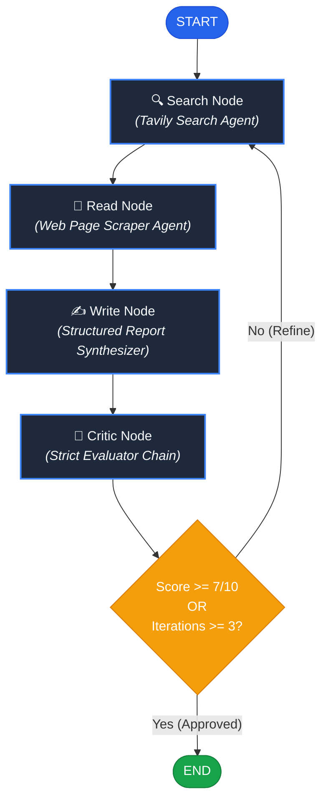

# Deep Research Agent

> An autonomous, self-correcting multi-agent research assistant powered by **LangGraph**, **Google Gemini**, and **Tavily Search** that crawls the web, reads source pages, synthesizes rigorous technical reports, and critiques its own work in an iterative feedback loop.

---

## Demo

Experience an end-to-end autonomous research workflow directly through an interactive **Streamlit** dashboard or a lightweight **Rich CLI**. Below is the visual walkthrough of the system in action:

### 1. Landing Interface & Trending Topic Prompts
Quick-select curated research topics or enter any open-ended research inquiry with pre-flight topic validation.


### 2. Live Multi-Agent Pipeline Status
Watch the LangGraph state transitions stream live across four distinct agent phases: **Search**, **Read**, **Write**, and **Critique**.


### 3. Synthesized Research Report (Overview & Findings)
Structured, publication-ready research reports featuring deep executive summaries and numbered technical findings.


### 4. Deep Insights & Verified Sources
Reports conclude with comprehensive synthesis and an authentic, click-through list of external source citations verified during web retrieval.


### 5. Automated Critic Review, Metrics & PDF Export
An independent reviewer agent audits report quality, provides numerical scoring (out of 10) with strengths and weaknesses, and enables one-click PDF downloading.


---

## Problem

Modern large language models suffer from several critical shortcomings when tasked with in-depth research:

* **Static Knowledge Cutoffs & Hallucinated URLs**: Standard LLMs cannot access real-time developments and frequently fabricate non-existent links and citations.
* **Superficiality in Single-Shot Generation**: Standard single-prompt queries generate generic overviews without actually reading and cross-referencing full web documents.
* **Absence of Self-Correction**: If an initial draft misses crucial dimensions or provides weak evidence, monolithic chatbots lack the self-reflective loop needed to evaluate and rewrite their output.
* **Manual Synthesis Friction**: Manually scouring search engines, filtering low-quality sites, extracting key paragraphs, writing structured summaries, and compiling reference citations is tedious and time-consuming.

**Deep Research Agent** solves this by decomposing the research lifecycle into specialized, coordinated autonomous agents guided by an evaluation graph that refuses to terminate until strict quality and citation standards are satisfied.

---

## Features

- 🧠 **Autonomous Multi-Agent Architecture**: Built with LangGraph to orchestrate dedicated Search, Reader, Writer, and Critic agents.
- 🌐 **Real-Time Live Web Intelligence**: Leverages the Tavily Search API to retrieve high-credibility, recent web documents.
- 📄 **Deep Page Scraping & Parsing**: Cleans and parses raw HTML content via BeautifulSoup, extracting informative text while stripping ads, scripts, and styling.
- 🛡️ **Topic Validation Gate**: Pre-screens inquiries with LLM guardrails to reject subjective, vague, or non-factual prompts before consuming scraping or search quotas.
- 🔁 **Self-Reflective Critique Loop**: An automated Critic agent rigorously scores drafts out of 10. If the score falls below **7/10**, the system automatically re-enters the search-read-write loop (up to 3 iterations).
- 🔗 **Strict Source Verification**: Extracts authentic, visited URLs directly from the agent execution trace, guaranteeing real, clickable Markdown citations without phantom links.
- 📊 **Streamlit Web UI**: Real-time status cards, dark-mode report viewer, metric indicators, and interactive expandable critique breakdown.
- 💻 **Rich Terminal CLI**: Beautiful command-line interface with formatted Markdown panels, headers, and colored status badges.
- 📥 **One-Click PDF Generation**: Converts markdown research reports into styled, production-quality PDF documents via `xhtml2pdf`.

---

## Architecture

The system utilizes **LangGraph** to model the research process as a directed state machine with dynamic conditional feedback:



### Shared State (`AgentState`)
Every node reads from and writes to a central state schema:

```python
class AgentState(TypedDict):
    topic: str              # User-provided research topic
    search_results: str     # Raw search snippets and metadata
    scraped_content: str    # Deep text extracted from scraped URLs
    sources: list[str]      # Deduplicated, verified external URLs
    report: str             # Synthesized markdown report
    critique: str           # Detailed audit feedback from critic
    score: int              # Integer quality score (1-10)
    iterations: int         # Count of research and rewrite cycles
```

---

## Tech Stack

| Category | Technology | Description |
| :--- | :--- | :--- |
| **Agent Orchestration** | [LangGraph](https://github.com/langchain-ai/langgraph) (v0.4+) | Stateful, cyclic multi-agent graph architecture |
| **Agent Framework** | [LangChain](https://github.com/langchain-ai/langchain) (v1.3+) | Tool binding, prompt templates, and output parsers |
| **Foundation Model** | [Google Gemini](https://ai.google.dev/) (`gemini-3.5-flash-lite`) | High-speed, high-reasoning inference via `langchain-google-genai` |
| **Web Search Engine** | [Tavily API](https://tavily.com/) | Real-time web search optimized for AI agents |
| **Scraping & Parsing** | [BeautifulSoup4](https://www.crummy.com/software/BeautifulSoup/) & `requests` | HTML extraction, DOM cleaning, and text extraction |
| **User Interface** | [Streamlit](https://streamlit.io/) (v1.45+) | Responsive, dark-themed dashboard with streaming state updates |
| **Terminal CLI** | [Rich](https://github.com/Textualize/rich) (v14.0+) | Terminal rendering with syntax highlighting and custom layout panels |
| **Document Export** | [xhtml2pdf](https://xhtml2pdf.readthedocs.io/) & Markdown | HTML/CSS styled PDF document compilation |

---

## Research Workflow

1. **Topic Validation**: The user inputs a research subject. `validate_topic()` verifies whether the topic is factual and researchable before pipeline execution.
2. **Search Stage (`search_node`)**: The Search Agent queries Tavily to retrieve relevant titles, snippets, and source URLs. URLs are regex-extracted and deduplicated in state.
3. **Deep Reading Stage (`read_node`)**: The Reader Agent evaluates candidate URLs, downloads target web pages, strips boilerplate (navbars, scripts, footers), and gathers detailed textual excerpts.
4. **Report Synthesis Stage (`write_node`)**: The Writer Chain synthesizes a formal report consisting of:
   * **Introduction**
   * **Key Findings** (minimum 3 concrete technical insights)
   * **Conclusion**
   * **Sources** (verified markdown links)
5. **Critique & Evaluation (`critic_node`)**: The Critic Chain grades the report against strict criteria:
   * Presence of at least 3 concrete, deep findings.
   * Real, clickable external source URLs listed under Sources.
   * Professional writing tone and clarity.
6. **Conditional Branching (`should_rewrite`)**:
   * If `score >= 7` or `iterations >= 3` $\rightarrow$ proceed to **END** (final report published).
   * Otherwise $\rightarrow$ loops back to **Search** to gather more details and resolve shortcomings.

---

## Project Structure

```plaintext
QM_V1/
├── assets/                          # Visual walkthrough screenshots for UI & reports
│   ├── Screenshot 2026-09-23 015702.png
│   ├── Screenshot 2026-09-23 020127.png
│   ├── Screenshot 2026-09-23 020254.png
│   ├── Screenshot 2026-09-23 020307.png
│   └── Screenshot 2026-09-23 020319.png
├── tools/                           # Agent tool definitions
│   ├── __init__.py                  # Tool exports
│   ├── scrape.py                    # Web scraping tool (BeautifulSoup + requests)
│   └── web_search.py                # Tavily search tool
├── agent.py                         # LLM agent definitions, prompt templates & validators
├── app.py                           # Streamlit interactive web application
├── graph.py                         # LangGraph state machine, nodes, and routing logic
├── main.py                          # Terminal CLI runner powered by Rich
├── requirements.txt                 # Pinned project dependencies
└── .env                             # Environment configuration (API keys)
```

---

## Installation

### Prerequisites
* Python 3.10, 3.11, or 3.12
* A [Google AI Studio](https://aistudio.google.com/) API Key (Gemini)
* A [Tavily](https://tavily.com/) API Key

### Setup Instructions

1. **Clone the repository:**
   ```bash
   git clone https://github.com/your-username/deep-research-agent.git
   cd deep-research-agent
   ```

2. **Create and activate a virtual environment:**
   * **Windows (PowerShell):**
     ```powershell
     python -m venv .venv
     .venv\Scripts\Activate.ps1
     ```
   * **macOS / Linux:**
     ```bash
     python3 -m venv .venv
     source .venv/bin/activate
     ```

3. **Install dependencies:**
   ```bash
   pip install -r requirements.txt
   ```

---

## Environment Variables

Create a `.env` file in the root directory and provide your API keys:

```ini
# Google Gemini API Key (used for LLM inference)
GOOGLE_API_KEY=your_gemini_api_key_here

# Tavily API Key (used for AI web search)
TAVILY_API_KEY=your_tavily_api_key_here
```

---

## Running the Project

### Option 1: Streamlit Web Dashboard (Recommended)

Launch the interactive web UI:

```bash
streamlit run app.py
```

The application will open in your default browser at `http://localhost:8501`.

### Option 2: Command-Line Interface (CLI)

Run the lightweight terminal runner:

```bash
python main.py
```

Enter your topic when prompted, and monitor the console output rendered in formatted Markdown and colored rule dividers.

---

## Example Usage

### Researching Emerging Tech

1. Enter a topic such as:
   ```text
   Agentic AI Workflows & Multi-Agent Systems in 2026
   ```
2. The agent executes the cycle:
   * **Search**: Identifies industry publications, benchmarks, and architectural analyses.
   * **Read**: Scrapes documentation and analysis from industry sources.
   * **Write**: Formulates key findings on goal-directed autonomy, multi-agent orchestration, and context engineering.
   * **Critique**: Validates presence of minimum 3 technical findings and live URL citations.
3. Review the generated report, read the critic's assessment, and download the report as a formatted PDF.

---

## API

The research pipeline can be embedded directly into custom Python services, backends, or Celery task queues:

```python
from graph import research_graph

# Initialize input state
initial_state = {
    "topic": "Post-Quantum Cryptography Migration & NIST Standards",
    "search_results": "",
    "scraped_content": "",
    "sources": [],
    "report": "",
    "critique": "",
    "score": 0,
    "iterations": 0,
}

# Run synchronously to completion
result = research_graph.invoke(initial_state)

print("Final Score:", result["score"])
print("Total Iterations:", result["iterations"])
print("Generated Report:\n", result["report"])
print("Sources Verified:\n", result["sources"])
```

### Streaming State Updates

```python
# Stream updates node by node for progress tracking
for update in research_graph.stream(initial_state, stream_mode="updates"):
    for node_name, node_state in update.items():
        print(f"Finished node: {node_name}")
```

---

## Evaluation

The Critic agent acts as an automated quality inspector using a structured prompt:

* **Evaluation Dimensions**:
  1. **Depth & Substance**: Minimum 3 concrete, technically detailed findings.
  2. **Citation Veracity**: Real, clickable external URLs under `Sources`. Reports that fail to cite verifiable URLs or falsely claim sources are heavily penalized.
  3. **Style & Structure**: Professional tone, logical flow, and clarity.
* **Scoring Rubric**:
  * `Score: 8-10/10`: High rigor, complete citations, publication-grade depth $\rightarrow$ **Approved**.
  * `Score: 7/10`: Satisfactory depth and citations $\rightarrow$ **Approved**.
  * `Score: < 7/10`: Shallow findings, missing URLs, or poor structure $\rightarrow$ **Triggers Rewrite Loop** (up to iteration cap).

---

## Limitations

* **Anti-Bot & CAPTCHA Protections**: Certain protected websites (e.g. Cloudflare Turnstile, paywalled journals) may block automated HTTP scraping, falling back on search snippets.
* **Scrape Length Truncation**: Scraped webpage text is truncated to 3,000 characters per page to prevent token overflow.
* **Maximum Iteration Bound**: The feedback loop caps at 3 iterations to prevent infinite loops and control API token consumption.

---

## Future Improvements

* [ ] **Parallel Search Execution**: Query multiple sub-topics simultaneously using async workers.
* [ ] **Headless Browser Scraping**: Integrate Playwright or Crawl4AI to parse JavaScript-rendered SPAs.
* [ ] **Vector Storage & RAG Memory**: Cache scraped research in ChromaDB / Pinecone for recurring topical queries.
* [ ] **Custom Export Formats**: Add DOCX, LaTeX, and Markdown bundle export options alongside PDF.
* [ ] **Configurable Evaluator Thresholds**: Allow users to adjust quality thresholds and maximum iteration depth directly from the UI.

---

## License

This project is licensed under the [MIT License](LICENSE).
